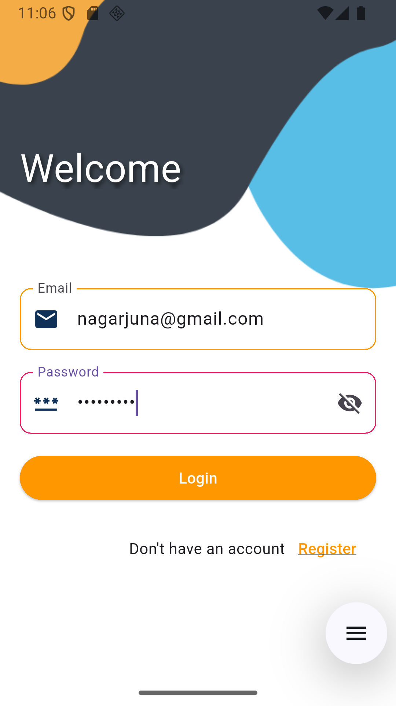
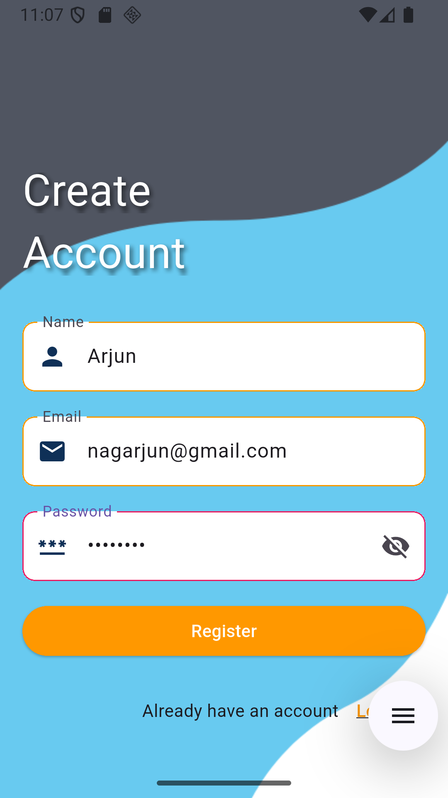
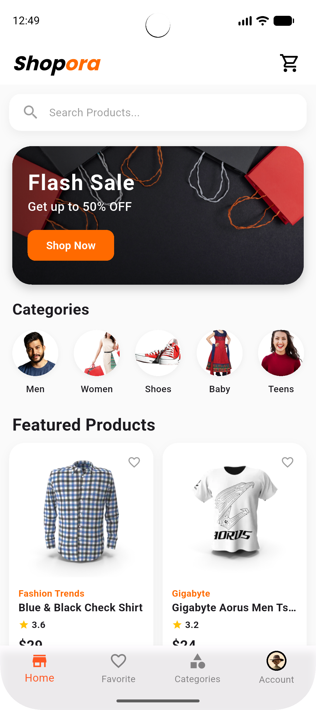
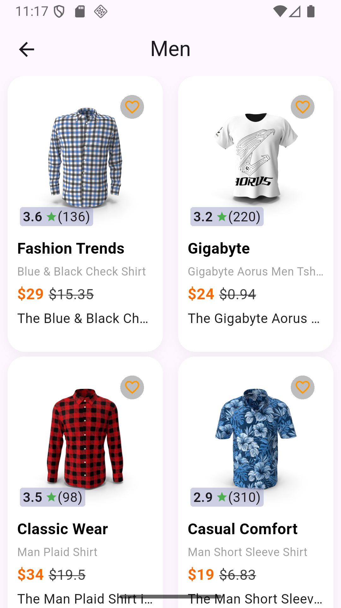
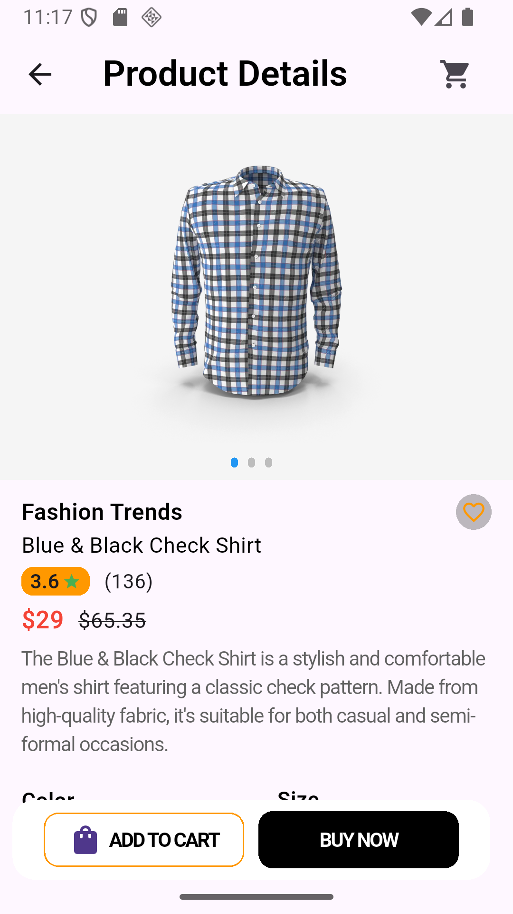
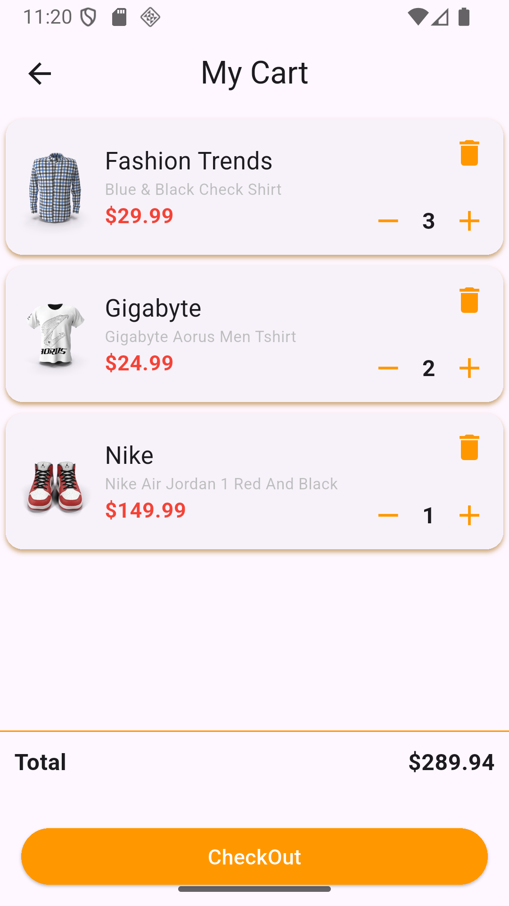
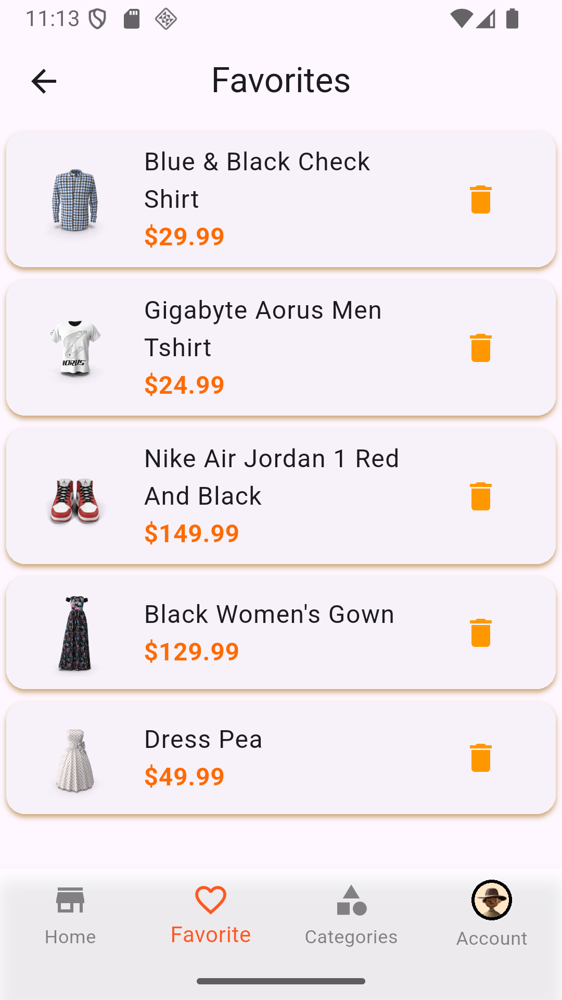
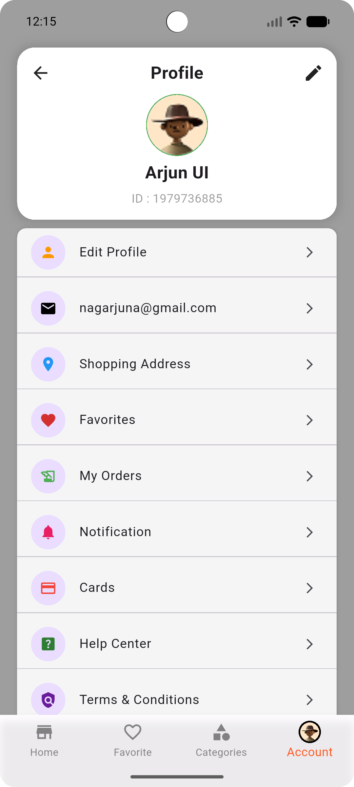

# 🛒 E-Commerce Flutter App

A fully functional and modern E-Commerce mobile application built using Flutter & Dart.  
This project demonstrates clean UI design, state management using Provider, REST API integration, filtering, favorites, and cart functionality.

---

## 🚀 Features

- 🚀 Splash Screen
- 🔐 Login Screen
- 📝 Register Screen
- 🏠 Home Screen
- 📂 Category Screen
- 🏷 Category Filter
- 🔎 Search & Filter Functionality
- ❤️ Favorites Screen
- 📦 Product Details Screen
- 🛒 Cart Screen
- 👤 Account Screen
- 🔄 Provider State Management
- 🌐 REST API Integration

---

## 📱 Screenshots

### 🚀 Splash Screen


### 🔐 Login Screen


### 📝 Register Screen


### 🏠 Home Screen


### 📂 Category Screen


### 🏷 Category Filter Screen


### 🔎 Search Query Screen


### 📦 Product Details Screen


### 🛒 Cart Screen


### ❤️ Favorites Screen


### 👤 Account Screen


---

## 🛠 Tech Stack

- Flutter
- Dart
- Provider (State Management)
- REST API Integration
- Clean Architecture
- Material Design

---

## 📂 Project Structure

```
lib/
├── models/              # Data models
├── providers/           # State management
├── screens/             # UI screens
│   ├── splash_screen.dart
│   ├── login_screen.dart
│   ├── register_screen.dart
│   ├── home_screen.dart
│   ├── category_screen.dart
│   ├── product_detail_screen.dart
│   ├── cart_screen.dart
│   ├── favorites_screen.dart
│   └── account_screen.dart
├── widgets/             # Reusable widgets
└── main.dart
```
