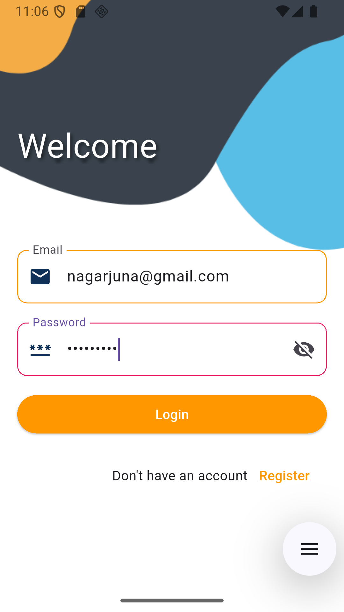
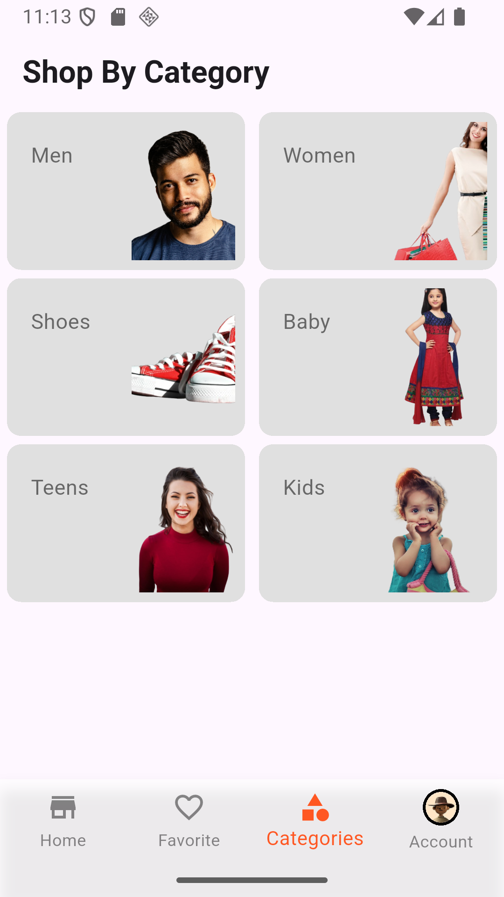
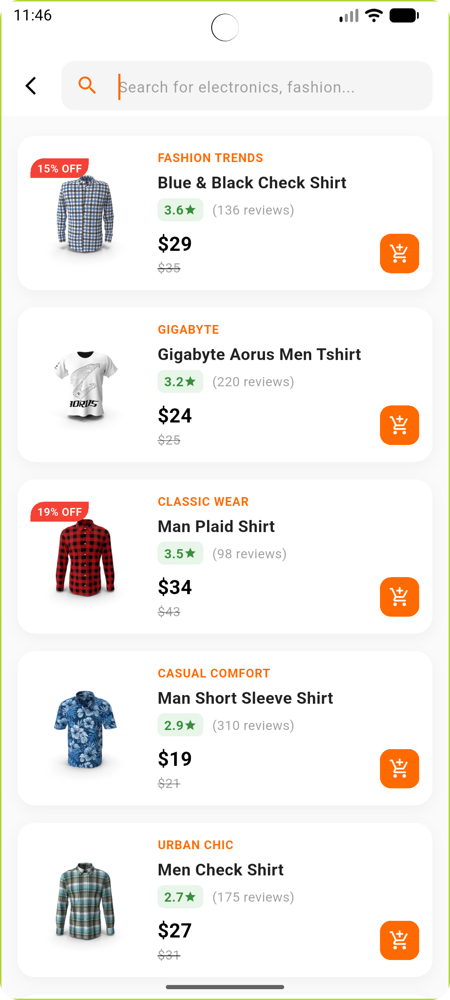
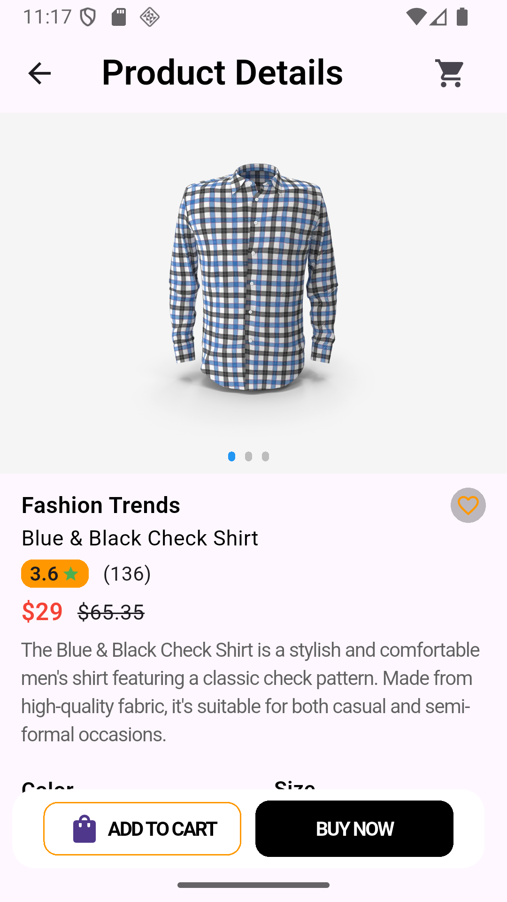
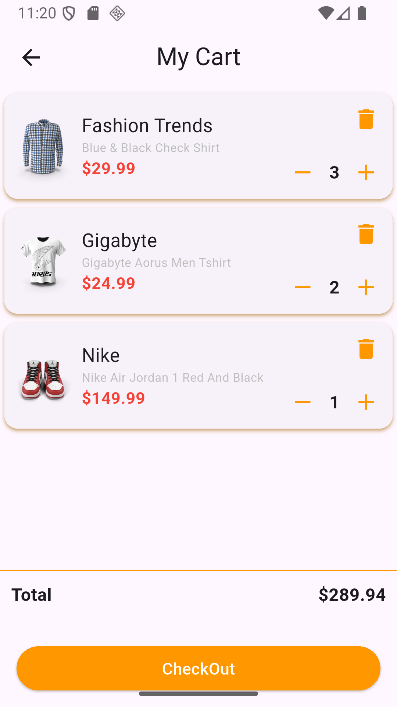
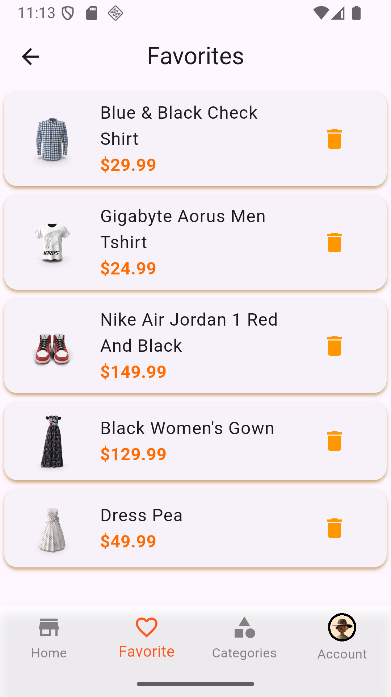
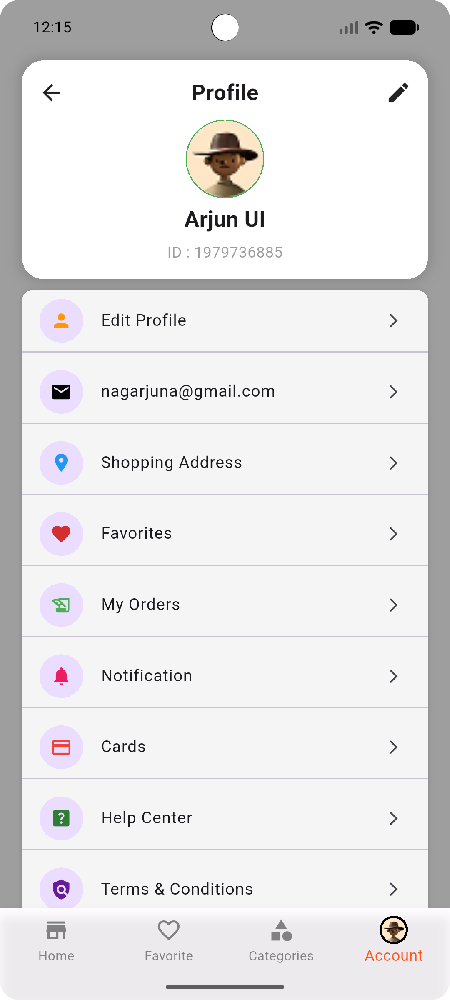
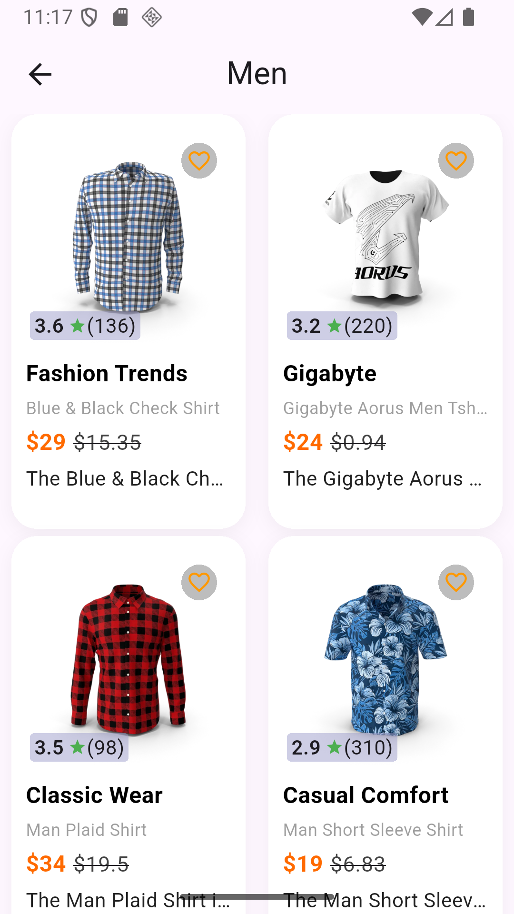

# 🛒 Shopora - Modern E-Commerce App

[](https://flutter.dev/)
[](https://dart.dev/)
[](https://pub.dev/packages/provider)

**Shopora** is a premium, fully-functional E-Commerce mobile application built using **Flutter**. It provides a seamless shopping experience with real-time data integration, smart search, and a modern UI.

This project uses **DummyJSON REST API** for product data and **Provider** for efficient state management, ensuring high performance without the need for a backend like Firebase.

---

## 🚀 Features

- ⚡ **Modern UI/UX**: Premium Deep Orange theme with Material 3 and Poppins font.
- 📦 **Live Product Data**: Fetches real-time products from **DummyJSON API**.
- 🔍 **Smart Search**: Real-time product search with instant results.
- 📂 **Categorized Browsing**: Filter products by categories like Fashion, Electronics, etc.
- 🛒 **Advanced Cart**: Manage items, adjust quantities, and calculate real-time totals (Tax + Delivery).
- ❤️ **Favorites System**: Save your favorite products for quick access.
- 💳 **Payment Integration**: Simulated checkout process with **Razorpay** support.
- 📱 **Responsive Design**: Fully optimized for all screen sizes (Mobile, Tablet).

---

## 📸 App Screenshots

### 🔹 Experience & Auth
| Splash Screen | Login Screen | Register Screen |
| :---: | :---: | :---: |
|  |  |  |

### 🔹 Discovery
| Home Screen | Categories | Search Filter |
| :---: | :---: | :---: |
|  |  |  |

### 🔹 Product & Shopping
| Details Page | Active Cart | Favorites |
| :---: | :---: | :---: |
|  |  |  |

### 🔹 User Profile
| Account Page | Category Filter |
| :---: | :---: |
|  |  |

---

## 📂 Project Structure

```
lib/
├── models/          # Data models (Product, Category, ProductMeta)
├── services/        # API integration (REST API - DummyJSON)
├── provider/        # State management (Auth, Cart, Product, Favorite)
├── screens/         # UI Screens (Home, Login, Search, Cart, etc.)
├── widgets/         # Reusable UI components
└── main.dart        # App entry point & Global Theme configuration
```

---

## 🛠 Tech Stack

- **Framework**: [Flutter](https://flutter.dev/)
- **Language**: [Dart](https://dart.dev/)
- **State Management**: [Provider](https://pub.dev/packages/provider)
- **API**: [DummyJSON REST API](https://dummyjson.com/)
- **Payment Gateway**: [Razorpay Flutter](https://pub.dev/packages/razorpay_flutter)
- **Fonts**: [Poppins](https://fonts.google.com/specimen/Poppins)

---

## ⚙️ Setup & Installation

1. **Clone the repo:**
   ```bash
   git clone https://github.com/Arjun-flutter/ecommers_app.git
   ```
2. **Install dependencies:**
   ```bash
   flutter pub get
   ```
3. **Run the application:**
   ```bash
   flutter run
   ```

---

Developed with ❤️ by **Nagarjuna Reddy Avula**
